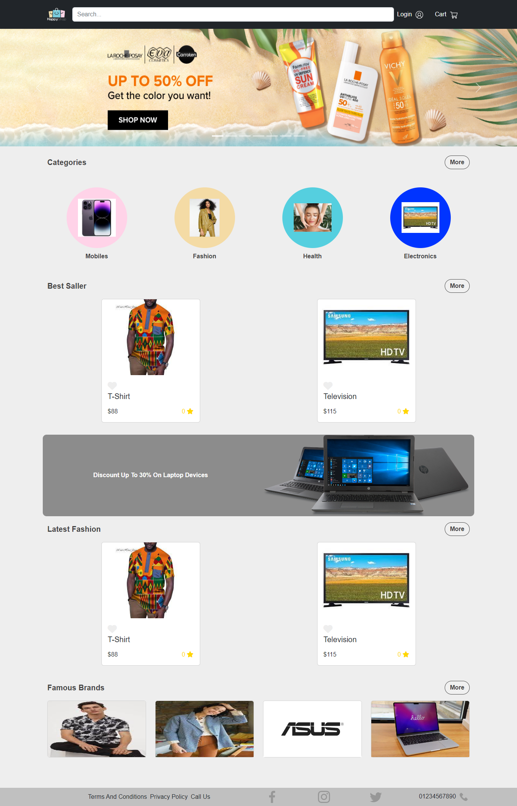

# E-commerce By Reactjs

## => Live Demo:

https://e-commerce-v1-react.netlify.app

## INTRODUCTION:

E-commerce is fast gaining ground as an accepted and used business paradigm. More and more
business houses are implementing web sites providing functionality for performing commercial
transactions over the web. It is reasonable to say that the process of shopping on the web is
becoming commonplace.

The objective of this project is to develop a general purpose e-commerce store where product
like clothes can be bought from the comfort of home through the Internet. However, for
implementation purposes, this paper will deal with an online shopping for clothes.

An online store is a virtual store on the Internet where customers can browse the catalog and
select products of interest. The selected items may be collected in a shopping cart. At checkout
time, the items in the shopping cart will be presented as an order. At that time, more
information will be needed to complete the transaction. Usually, the customer will be asked to
fill or select a billing address, a shipping address, a shipping option, and payment information
such as credit card number. An e-mail notification is sent to the customer as soon as the order
is placed.

## Description:

 Any member can register and view available products.
 Only registered member can purchase multiple products regardless of quantity.
 ContactUs page is available to contact Admin for queries.
 There are three roles available: Visitor, User and Admin.
• Visitor can view available products.
• User can view and purchase products.
• An Admin has some extra privilege including all privilege of visitor and user.
 Admin can add products, edit product information and add/remove
product.
 Admin can add user, edit user information and can remove user.
 Admin can ship order to user based on order placed by sending
confirmation mail.

## Web Pages details:

 Home Page
 AboutUs Page
 Clothing Page
 OrderUs Page
 ContactUs Page
 Admin Page
 Login Page
 Register Page
and others...

## Technologies

react - axios - bootstrap - multiselect-react-dropdown - react-bootstrap - react-color - react-detect-offline - react-image-gallery - react-multiple-image-input - react-paginate - react-rating-stars-component - react-redux - react-responsive-carousel - react-router-dom - react-toastify - redux - redux-thunk - unop-react-dropdown

## Features

### For Admin:

Has a dashboard contain alots of pages and features:

#### Oreders Managment

#### Products Managment

#### Add Brand

#### Add Category

#### Add Subcategory

#### Add Product

#### Add Coupon

### For Users:

Has a profile contain alots of pages and features:

#### Signup

#### Login

#### Profile

#### Cart

#### Payment (cash or visa)

